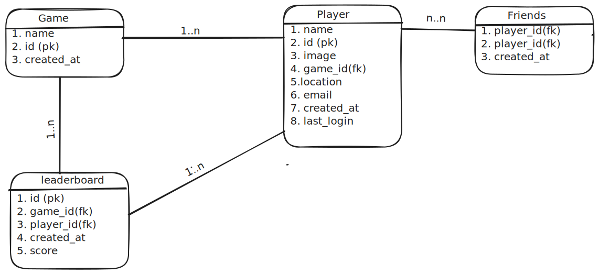
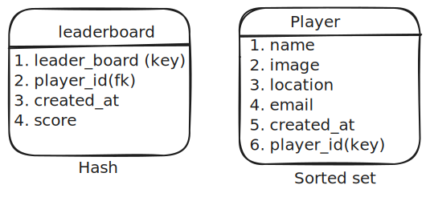
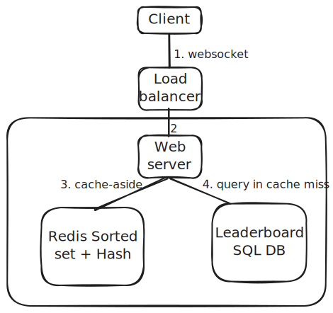
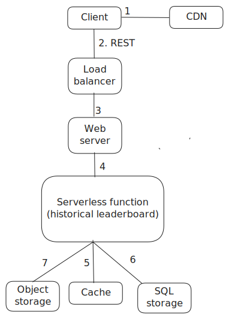

# Leaderboard

## Requirements

### Functional

1. User should be able to see top 10 players based on score
2. Can see specific player's rank as well
3. Can see surrounding players rank if search a specific player
4. leaderboard can rank player's based on daily, monthly (time filter)
5. Can see historic match leaderboard as well
6. Leaderboard can be updated in full distributed manner
7. Should support thousand of players
8. Need realtime

### Non functional

1. High availability
2. Low latency
3. Scalability
4. Reliability

## Estimation

1. Users are globally distributed
2. read/write ratio - 5:1
3. Daily active users for writes - 50 Million
4. Player id can be 30 bytes string and score can be 16 bit int consuming 2 bytes.

### Traffic

| Desc           | value                                     |
| -------------- | ----------------------------------------- |
| DAU (write)    | 50 M                                      |
| QPS(write)     | (50M)/(sec in one day) = 587 (600 approx) |
| QPS(read)      | 600\*5 = 3000                             |
| Peak QPS(read) | 4000 (assumption)                         |

### Memory (for fater use)

| Desc                         | value             |
| ---------------------------- | ----------------- |
| total player                 | 50 M              |
| Single player record         | (30+2) = 32 bytes |
| total storage for all player | 50M\*32 = 1.6 GB  |

### Storage

| Desc                                     | value                     |
| ---------------------------------------- | ------------------------- |
| storage for a day all player             | 1.6 GB                    |
| total storage for all player for 5 years | 1.6 GB * 5 *365 = 2.92 TB |

### Bandwidth

**Ingress** is the network traffic that enters the server (client requests) and **Egress** is the network traffic that exits the server(server resp)

| Desc    | value                                                                    |
| ------- | ------------------------------------------------------------------------ |
| Ingress | 32 bytes/player _ 50M players/day _ 10^-5 day/sec = 16 KB/sec            |
| Egress  | 64 bytes/player _ 250 million players/day _ 10^(-5) day/sec = 160 KB/sec |

### API design

1. for each of scalability we will be using REST. as it allows loose coupling as than RPC.

#### Update player score

1. Request
   ```
   /players/:player-id/scores
   method: POST
   authrorization: Bearer <token>
   content-length: 100  (size of the request body in bytes)
   content-type: application/json
   content-encoding: gzip (lossless encoding for reduced data size)
   {
       player_id:<int>,
       score:<int>,
       location:geohash
   }
   ```
2. Response
   ```
   200 - success
   202 - accepted for async processing
   403 - Unauth
   400 - invalid payload
   ```

#### Get a single player score

1. Request

   ```
   /players/:player-id
   method: GET
   authrorization: Bearer <token>
   accept: application/json, text/html
   user-agent: chrome
   ```

2. Response

   ```
   status code: 200 OK
   cache-control: private, no-cache, must-revalidate, max-age=5
   content-encoding: gzip
   content-type: application/json

   {
       player_id: <string>,
       player_name: <string>,
       score: <int>,
       rank: <int>,
       updated_at: <date_timestamp>
   }
   ```

   ```
   403 - Unauth
   404 - not found
   ```

#### Get top N player

1. Request

   ```
   /players/top/:count
   method: GET
   authrorization: Bearer <token>
   accept: application/json, text/html
   user-agent: chrome
   ```

2. Response

   ```
   status code: 200 OK
   cache-control: public, no-cache, must-revalidate, max-age=5
   content-encoding: gzip
   content-type: application/json

   {
       count: 10(count),
       updated_at:<timestamp>,
       data: [
           {
               player_id: <string>,
               player_name: <string>,
               score: <int>,
               rank: <int>
           }
       ]
   }
   ```

   ```
   403 - Unauth
   ```

#### Get surrounding players score

1. Request

   ```
   /players/:player-id/:count
   method: GET
   authrorization: Bearer <token>
   accept: application/json, text/html
   user-agent: chrome
   ```

2. Response

   ```
   status code: 200 OK
   cache-control: public, no-cache, must-revalidate, max-age=5
   content-encoding: gzip
   content-type: application/json

   {
       count: 10(count),
       updated_at:<timestamp>,
       data: [
           {
               player_id: <string>,
               player_name: <string>,
               score: <int>,
               rank: <int>
           }
       ]
   }
   ```

   ```
   403 - Unauth
   ```

#### Service health

```
/:service/health
method: HEAD
```

Response

```
200 - OK
500 - error
```

### DB

### SQL schema

<p align="center">
    
</p>

### Redis schema

<p align="center">
    
</p>

1. here Game and player table is having `1 to many` bsc one player can play multiple games
2. Friends and player is like follower-followee relationship. (associate entity)
3. Games and leaderboard is `1 to many` as one game can have multiple leaderboards like regional, global, friend_circle.
4. Players and leaderboard is also `1 to many` as one player can be part of multiple games so multiple leaderboards.
5. SQL database is good if we have to design system for mid level usage and for high usage system Relational DB is not favourable bcs of few reason

   1. Everytime we have to calculate the rank the full table lookup is needed
   2. Also if we do indexing the write will become expensive and it will not bring much speed
   3. Caching will have stale data issue
   4. the computation of rank in player will require nested queries will not be efficient.

6. For our usecase we need a DB that store data in sorted manner so the fetch of data is very fast. [Redis sorted-set](../Technologies/redis-sorted-set.md) is a good option for this.
7. So choice is

   1. Redis sorted set , but as we know redis sorted set only store score and member identifier so we can use a combination of `Sorted set + Hash` to store data.
   2. identifier can contain data like `user:id` .
   3. In Hset we can store data like

   ```sh
   HSET user:123 name "John Doe" image "john.jpg" location "USA" email "john@example.com"
   ```

   4. Image can be stored in object storage Amazon S3

8. How we will achieve other functionalities in case of redis DB

   1. leaderboard based on game - make a new sorted set
   2. Similar can be done for based on location and all
   3. or another thing can be we can store other data in DB (other than redis) and fetch data based on user id

### High Level Design

<p align="center">
    
</p>

1. The client creates a WebSocket connection to the load balancer for real-time communication
2. The load balancer delegates the client’s request to the closest data center
3. The server queries the cache server to display the leaderboard
4. The server queries the relational database on a cache miss and populates the cache server with fetched data
5. In cache miss we can use `LRU` policy.

### Design Deep dive

#### Get top 10 players

```sh
ZREVRANGE <key> <start> <stop>
e.g.
ZREVRANGE leaderboard 0 9
```

After this we can get metadata of the players using the command `HMGET` from the Hash.

#### Get rank of a given player

```

ZREVRANK <key> <member>

returns the rank of member in the sorted set stored at key, with the scores ordered from high to low. The rank is 0-based, which means that the member with the highest score has rank 0.

e.g.
ZREVRANK leaderboard "user:id"
```

#### Get surrounding player for a given game

1. Fetch rank of given player
2. Get surrounding players based on the rank-x to rank+x

```sh
ZREVRANK leaderboard "user:id"

res : (integer) 11

ZREVRANGE leaderboard 8 14
```

FOR MORE DESC visit : [Redis Sorted set](../Technologies/redis-sorted-set.md)

#### How to send score notification update

1. DB change can trigger (when score of a player is beaten by another) serverless function call to notify.
2. We can also use the [Bloom filter](../premier/Uncategorized/Bloom-filters.md) to make sure user receives notifcation only once on rating change.
3. we can use [Pub-sub](../premier/Scalability-files/Message-Queue.md#types) pattern for this.

PENDING

#### Global leaderboards

1. We can manage multiple sorted sets for distinct gaming scenarios. The global sorted-set can include the agreegated score across all gaming scenarios.
2. Can use [ZUNIONSTORE](../Technologies/redis-sorted-set.md#union-multiple-set-to-create-a-global-leaderboard) command.

#### Historical leaderboards

<p align="center">
    
</p>
1. We can use ttl based cache for historical leaderboards and also we can utilize REST instead of socket as global leaderboard can use polling, and big in size.
2. Historical we can move to cols storage for cost efficiency
3. Flow
   1. Client checks in CDN for extremely popular leaderboards
   2. client -> LB -> server -> serverless fn
   3. serverless function is easy to scale and cost effetive, it checks cache first and if not found in cache then check relational DB, and for image fetch from object storage.

#### Leaderboards based on daily, weekly, monthly

A new sorted set can be created for different time ranges. At the time end we can calculate from existing and do.

#### Leaderboards for friend circle

we can create a friend leaderboard
| Feature | Redis Implementation |
|-----------------------------|----------------------------------------------------------|
| **Global Leaderboard** | `ZADD global_leaderboard <score> <user_id>` |
| **Store Friends** | `SADD friends:<user_id> <friend1> <friend2>` |
| **Create Friend Leaderboard** | `ZADD leaderboard:<user_id> <score> <friend_id>` |
| **Fetch Friend Leaderboard** | `ZRANGE leaderboard:<user_id> 0 -1 WITHSCORES` |
| **Update Friend Leaderboard** | `ZADD leaderboard:<user_id> <updated_score> <friend_id>` |

....manythings yet to think Scaling
