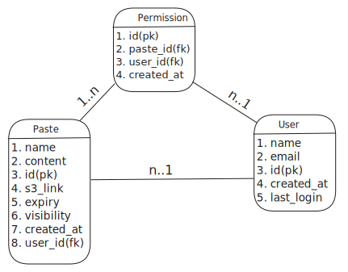
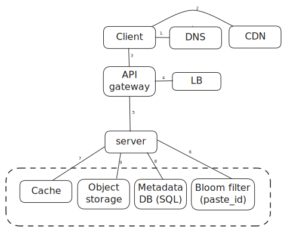

# Pastebin

## Requirements

### Functional

1. User should be able to paste data upto 1MB size
2. Customized urls
3. Expiration (Optional to ask to user or a preset defined)
4. Support text based data only
5. User is able to set visibility of a url to public or private
6. User can delete the paste as well if created by him only

### Non functional

1. High availability
2. Low latency
3. Durability

## Estimation

1. Per day write - 1M
2. read/write ratio - 10:1
3. Avg paste size - 100 KB
4. Max paste size - 1 MB

### Traffic

| Desc           | value                                 |
| -------------- | ------------------------------------- |
| QPS(write)     | (100k)/(sec in one day) = 10 (approx) |
| QPS(read)      | 10\*10 = 100                          |
| Peak QPS(read) | 40 (assumption)                       |

### Storage

| Desc               | value                   |
| ------------------ | ----------------------- |
| storage per day    | 1MBx1M = 1 TB           |
| storage for 5 year | 1 GB x 365 x 5 = 1.8 PB |

### Bandwidth

| Desc    | value                                                  |
| ------- | ------------------------------------------------------ |
| Ingress | 1MB/paste x1M paste/day x 10^(-5)day/sec = 10 MB/sec   |
| Egress  | 1MB/paste x10M reads/day x 10^(-5)day/sec = 100 MB/sec |

### Memory(Caching)

We can follow the 80/20 rule while caching where 80% of the trafic is server by 20% cached result and rest can be done from server. We can use cache with a TTL of 1 day.

| Desc       | value                                 |
| ---------- | ------------------------------------- |
| cache size | 1MB/paste x10M paste/day x 0.2 = 2 TB |

## API Design

We can use REST for ease of loose coupling and easiness to debug.

### Create paste

Request

```sh
/pastes
method: POST
authorization:...
{
   name:<string>,
   content:<string>,
   visibility:<enum>,
   custom:<string>, (optional)
   expiry:<dattime> (optional)
}
```

Response

```sh
201
{paste-id-url}

401 - unauth
```

### Get paste

Request

```sh
/pastes/:paste-id
method: GET
authorization:...
```

Response

```sh
200
{
   name:<string>,
   content:<string>,
   visibility:<enum>,
   id:<string>, (optional)
   expiry:<dattime> (optional),
   s3_link:<string>
}


401 - unauth
```

### Delete paste

```sh
/pastes/:paste-id
method: DELETE
authorization:...
```

## Database

1. As there it is going to be a lot of data so we need to make decision which DB we want to use. I am planning to choose SQL because of this point
   1. Strict schema
   2. relational data
   3. need of complex joins
   4. lookup by index
2. Also there is size very huge so we can store huge content on s3 object storage as it will cost effectively and reduce DB io.
3. Some alternative to S3 is mongodb.

<p align="center">
   
</p>

## HLD

### Encoding

1. we need to encode our pasteId into some format for readability. we can use base58 format.
2. base58 is similar to base62 bur it doesn't contain non-distinguishable char like (`O (uppercase O), 0 (zero), and I (capital I), l (lowercase L)`).
3. so range of base58 - A-z a-z 0-9 (exclude above four char)
4. Total paste id possible for a 8 length base58 id = 58^8 = **128 trillion**

### Write paste

<p align="center">
   
</p>

1. Single machine solution will not scaleout so we move the Key Generation service (**KGS**) outside as a service.
2. Operations done when client enters a paste
   1. write call is rate limited
   2. KGS creates a unique encoded pasteid
   3. we get [pre-signed url](https://docs.aws.amazon.com/AmazonS3/latest/userguide/using-presigned-url.html)
      1. system requests a pres-signed url from the object storage.
      2. A presigned URL allows the client to upload content directly to storage without needing authentication each time.
   4. Paste url is created by appending pasteid.
      1. `http://presigned-url/paste-id`
   5. The paste content is transferred directly from the client to the object storage using the paste URL to optimize bandwidth expenses and performance
   6. The object storage persists the paste using the paste URL
   7. The metadata of the paste including the paste URL is persisted in the SQL database
   8. The server returns the paste ID to the client for future access
3. Some other things we can perform on server
   1. Huffman encoding for reducing text size
   2. content encryption
   3. Use bloom filter in case if custom url is requested, we can check if custom url is already present or not
4. **Random ID Generation**
   1. we can pick one of the following multiple approach
      1. Twitter's snowflake
      2. MD5 + hashing (something that we followd in url shortener)

### Read paste

<p align="center">
   
</p>

1. Using cache-aside pattern and for eviction use LRU
2. We are introducing cache at following level
   1. CDN (public cache) - reduce load on system
   2. internal cache on data store
   3. client side cache (browser)
3. API gateway handles
   1. rate limiting
   2. Auth
   3. compressing
   4. filtering
4. Bloom filter is used to avoid cache thrashing, we set bloom fiters when an element accessed more than twice, and if bloom found for paste then only it will be written to cache.
5. We will shard the DB based on user_id

// pending

## Deep dive

### Scalability

### Rate limiting

### Availability

### Fault Tolerance

### Analytics

### DB cleanup

### Security
