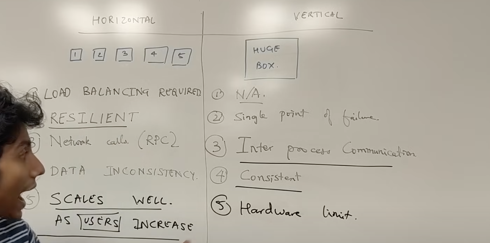
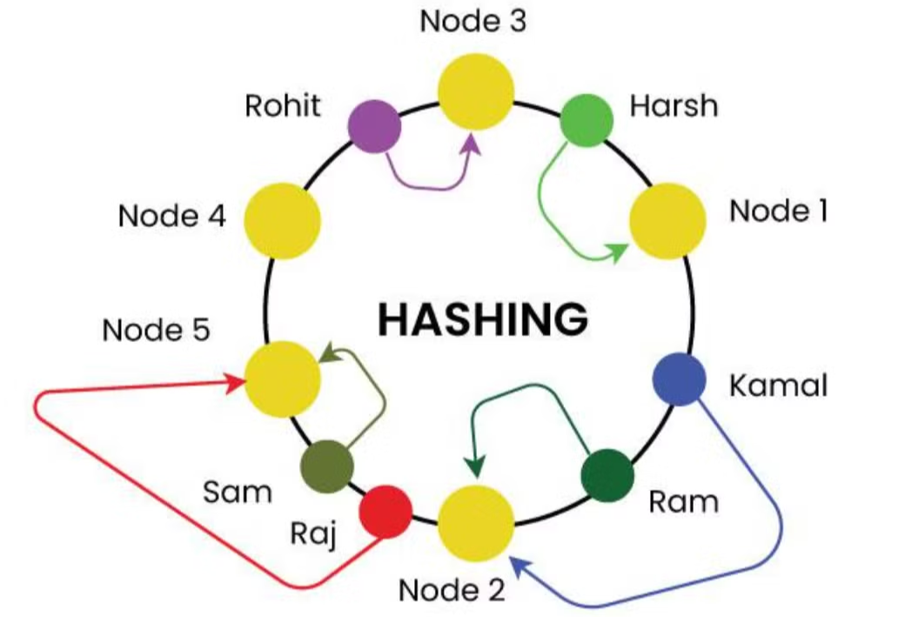

# Part 1

**Horizontal vs Vertical scaling**
buying more machine vs buy big machine

1. HLD (how our services going to communicate), LLD(How we are going to design classes)
2. How to get started with a distributed system

   1. vertical scaling: optimise precision and increase throughput with the same resources
   2. preprossing (e.g cron job) : prepare before hand during non pick hours
   3. Backups: keep backups and avoid single point of failure
   4. horizontal scaling: get more resources
   5. micro service architecture
   6. distributed system (partioning)
   7. load distribution
   8. Decoupling
   9. Logging
   10. extensible

3. Consistent Hashing [LINK](https://www.geeksforgeeks.org/consistent-hashing/)

   1. Here the node(servers) and users(request) are put on the same ring, and whenever a request comes we traverse clockwise which ever server is found first that will serve the request.

      1. The server nodes can be placed at random locations on this ring which can be done using hashing.
         

      2. But suppose if node 2 fails then all the load of node 2 will be transefered to node 5 that will be an issue. so to solve this problem what we did we make the virtual servers
         1. like the servers are placed on the ring by using one hash function but what if we use multiple (let say k) hash function and we can place same server at k different places. this will solve above problem.
         2. the best solution is not to use K hash functions, but to generate K replica ids for each server id. Designing K hash functions while maintaining random uniformity and consistency is hard. Generating K replica ids is easy: xxx gives K replicas xxx + '1', xxx + '2', ..., xxx + 'K'. Then you take these replicas and generate K points on the ring with the same hash function

4. Message/Task Queue [LINK](https://www.geeksforgeeks.org/message-queues-system-design/)

   1. A message queues is a form of service-to-service communication that facilitates asynchronous communication. It asynchronously receives messages from producers and sends them to consumers.
   2. Messaging Queues provide useful features such as persistence, routing, and task management.
   3. Servers are processing jobs in parallel. A server can crash. The jobs running on the crashed server still needs to get processed.
   4. A notifier constantly polls the status of each server and if a server crashes it takes ALL unfinished jobs (listed in some database) and distributes it to the rest of the servers. Because distribution uses a load balancer (with consistent hashing) duplicate processing will not occur as job_1 which might be processing on server_3 (alive) will land again on server_3, and so on.
   5. This "notifier with load balancing" is a "Message Queue".
   6. Message queue vs PUB sub [LINK2](https://medium.com/@osama94/pub-sub-system-vs-queues-9a5fd872f474), [LINK](https://systemdesignschool.io/blog/message-queue-vs-pub-sub),

5. Micro services vs Monolith [LINK](https://www.geeksforgeeks.org/monolithic-vs-microservices-architecture/#what-is-a-monolithic-architecture)

   1. Monolith doesn’t mean that service will run only on one machine, it can run on multiple

      

      points for when to choose which

      

## 6. DB Sharding [WORKING](https://medium.com/@jeeyoungk/how-sharding-works-b4dec46b3f6)

1.  There are two type of partioning in DB Vertical AND Horizontal. [LINK](https://stackoverflow.com/questions/18302773/what-are-horizontal-and-vertical-partitions-in-database-and-what-is-the-differen)
    1.  **Horizontal partitioning** involves putting different rows into different tables. Perhaps customers with ZIP codes less than 50000 are stored in CustomersEast, while customers with ZIP codes greater than or equal to 50000 are stored in CustomersWest. The two partition tables are then CustomersEast and CustomersWest, while a view with a union might be created over both of them to provide a complete view of all customers.
    2.  **Vertical partitioning** involves creating tables with fewer columns and using additional tables to store the remaining columns. Normalization also involves this splitting of columns across tables, but vertical partitioning goes beyond that and partitions columns even when already normalized.
2.  Sharding a database is a common scalability strategy for designing server-side systems. The server-side system architecture uses concepts like sharding to make systems more scalable, reliable, and performant.
3.  Sharding is the horizontal partitioning of data according to a shard key. This shard key determines which database the entry to be persisted is sent to. Some common strategies for this are reverse proxies.
4.  There are also some issue in sharding
    1.  suppose when querying we need data from 2 shards then we have to perform join (kind of expensive and complex)
    2.  Also as when we design DB we sharded so it has only fixed number of shard
        1.  one solution to this is dynamically break existing shard into more sub shard
5.  Best practice
    1.  we can add indexes to each shard based on need
