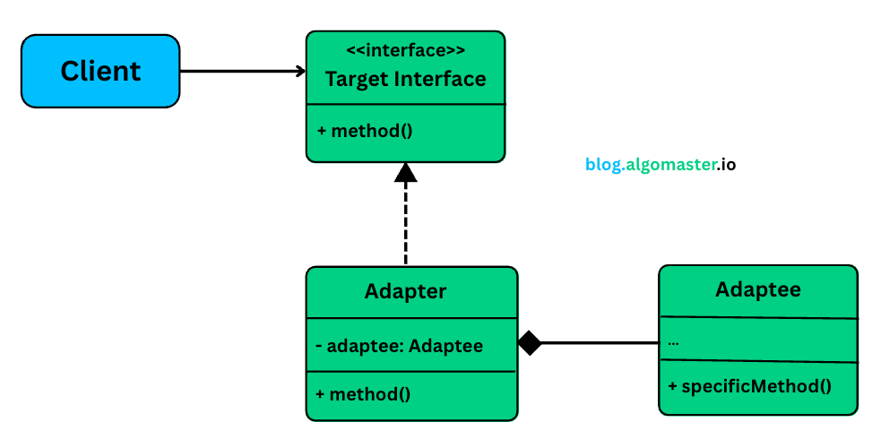

# Adapter Design Pattern

- It is a **structural** design pattern that allows incompatible interfaces to work together by the converting the interfaces into one class that client expects.

## Useful in situations

- where we have to integrate with the legacy system or third party library which doesn't match current interface.
- Want to make unrelated classes work together

## Example without using adapter

- I have a payment system which currently only support legacy Bank Transfer but i want to implement modern stripe so
- first soln can be with writing conditional logic based on type but it further violate **Open/Closed** principle and make code tightly coupled.
- Current interfaces look like this

```java
public interface PaymentProcessor {
    void processPayment(double amount,String currency);
    bool isPaymentSuccess();
    String getTransactionId();
}
```

- and have a Checkout service which accept payment processor

```java
public class CheckoutService {
    private PaymentProcessor processor;

    ... further it used PaymentProcessor method to complete payment and check status
}
```

- Now we get requirement of integrating a legacy method for which interface like

```java
public interface LegacyProcessor {
    void executePayment(double amount,String currency);
    String getStatus(long tid);
    long getPaymentRefrence();
}
```

- So if we want to serve with LegacyProcessor as well and we have some constraint
  - Can't change CheckoutService as it is used at lot of other place
  - Can't modify legacy code
  - both option should work together

## Adapter Pattern

- To solve above issue adapter pattern comes into picture

### Class Diagram

<p align="center">
    
</p>
