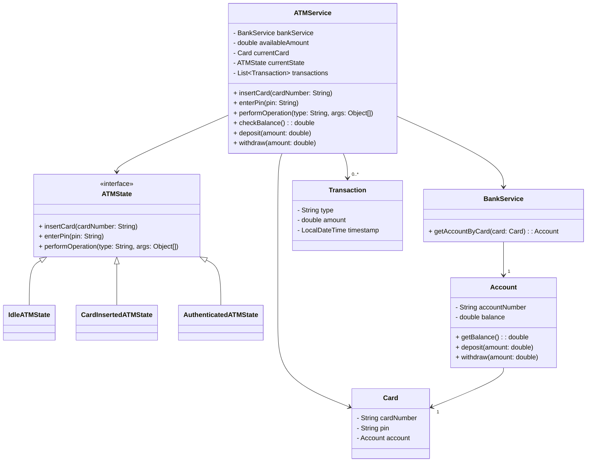

# ATM Service LLD Implementation

## Problem Statement

Design an ATM system that supports card insertion, PIN authentication, and basic banking operations (deposit, withdraw, balance inquiry). The system should be extensible, maintain state transitions, and allow for easy addition of new features.

## Requirements

- Card insertion and ejection
- PIN authentication
- Banking operations: deposit, withdraw, balance inquiry
- Transaction logging
- State management for ATM (Idle, Card Inserted, Authenticated)
- Extensible for new operations and states

## How to Run

Use `ATMServiceDemo.java` to see example usage.

## Design Patterns Used

- **Singleton:** `ATMService` ensures only one instance exists.
- **State:** ATM state transitions (`IdleATMState`, `CardInsertedATMState`, `AuthenticatedATMState`) manage allowed operations.
- **Strategy:** Transaction types and operations are handled via enums and state classes.

## Class Diagram (Generated With AI help)

