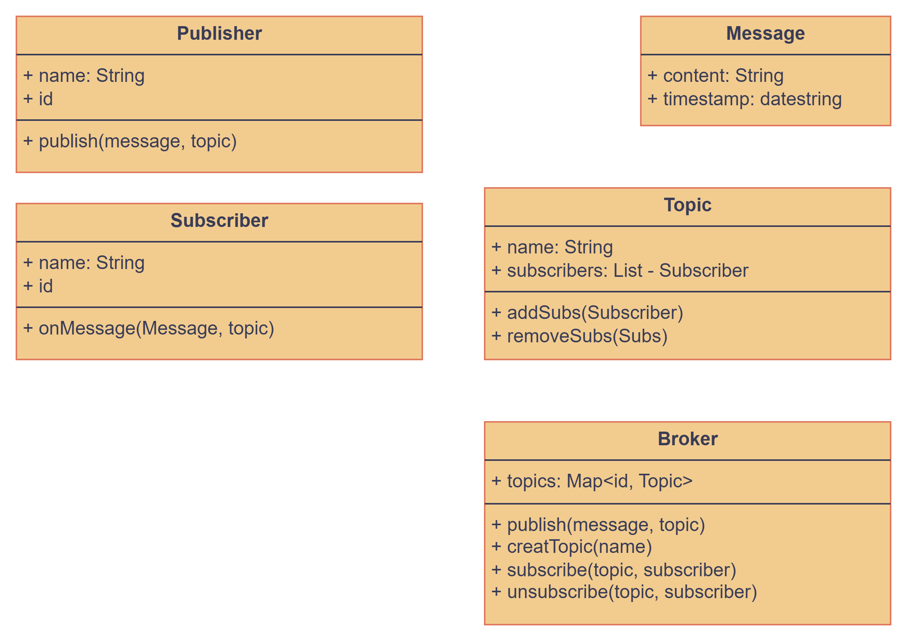

# PubSub System LLD Implementation

## Problem Statement

Design a Publisher-Subscriber (PubSub) messaging system that allows decoupled communication between publishers and subscribers through topics. The system should support multiple publishers and subscribers, message delivery, and topic-based message routing.

## Requirements

- Support for multiple publishers and subscribers
- Topic-based message routing
- Message publishing and delivery
- Support for multiple topics

## How to Run

Use `PubSubDemo.java` to see example usage.

## Design Patterns Used

- **Observer:** Subscribers observe topics for new messages
- **Mediator:** Broker acts as a mediator between publishers and subscribers
- **Factory:** Message creation and handling

## Class Diagram

## Core Components

1. **Broker:** Central component that manages topics and message routing
2. **Topic:** Represents a message category and maintains list of subscribers
3. **Publisher:** Creates and publishes messages to topics
4. **Subscriber:** Receives messages from topics they are subscribed to
5. **Message:** Contains the actual message content and metadata

## pending

- event driven
