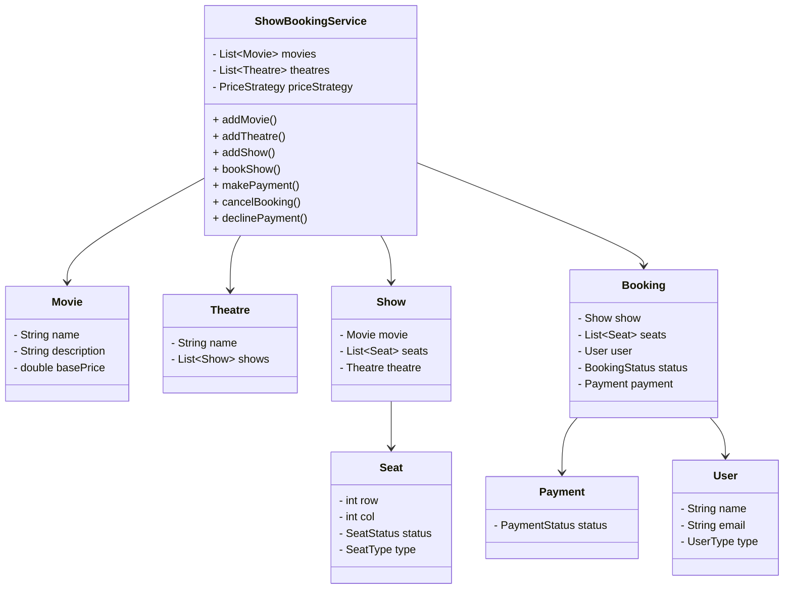

# Show Booking LLD Implementation

## Problem Statement

Design a movie show booking system that supports multiple theatres, movies, shows, seat types, and flexible pricing strategies. The system should allow users to book/cancel seats, make/decline payments, and be easily extensible for new requirements.

## Requirements

- Support for multiple theatres, movies, and shows.
- Different seat types (Normal, Premium).
- Flexible price strategies for seat pricing.
- User roles (Admin, Normal user) with restricted actions.
- Booking, payment, and cancellation workflows.
- Thread-safe operations for booking and payment.

## How to Run

Use `ShowBookingDemo.java` to see example usage.

## Design Patterns Used

- **Singleton:** `ShowBookingService` ensures only one instance exists.
- **Strategy:** Pricing uses the `PriceStrategy` interface for flexible seat pricing.
- **Factory:** `BookingFactory` for booking creation.

## Class Diagram

