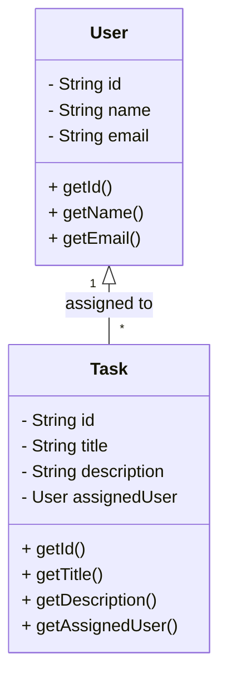

# Task Manager LLD Implementation

## Problem Statement

Design a simple task manager system that supports user management and task assignment. The system should allow creating users, assigning tasks, and retrieving user/task information. It should be easily extensible for new requirements.

## Requirements

- User creation and management.
- Task creation and assignment to users.
- Retrieval of user and task details.
- Extensible for additional features (e.g., task status, deadlines).

## How to Run

Use the main class (e.g., `Runner.java` or a demo class) to see example usage. (Update this section with the actual entry point if available.)

## Design Patterns Used

- **Encapsulation:** User and Task details are encapsulated in their respective classes.
- **Separation of Concerns:** User and Task logic are separated for maintainability.

## Class Diagram (Generated With AI help)

This diagram covers the main classes: User and Task, and their relationship.

## How to Extend

- **Add Task Features:** Add fields to `Task` (e.g., status, deadline, priority).
- **Add User Features:** Add fields to `User` (e.g., role, contact info).
- **Add Operations:** Implement methods for updating, deleting, or searching users/tasks.
- **Add Persistence:** Integrate with a database or file system for data storage.
