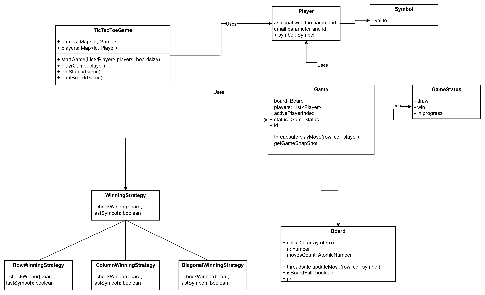

# Tic Tac Toe LLD Implementation

## Problem Statement

Design a flexible and extensible Tic Tac Toe game system that supports different board sizes, multiple players, and pluggable winning strategies. The system should allow easy addition of new rules and strategies, and provide a clean API for playing moves and checking game status.

## Requirements

- Support for variable board sizes (e.g., 3x3, 4x4).
- Multiple players with custom symbols.
- Pluggable winning strategies (row, column, diagonal, etc.).
- Game status reporting (in progress, win, draw).
- Easy extensibility for new rules or strategies.

## How to Run

Use `TicTacToeGameDemo.java` to see example usage and test cases.

## Design Patterns Used

- **Singleton:** `TicTacToeGame` ensures only one game manager instance exists.
- **Strategy:** Winning logic uses the `WinningStrategy` interface for flexible win conditions.

## Class Diagram

