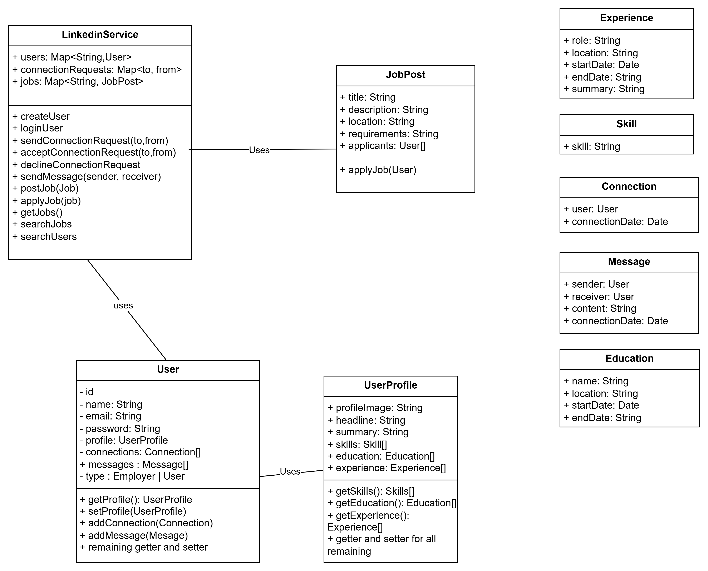

# Linkedin LLD Implementation

## Problem Statement

Design a LinkedIn-like system that supports user profiles, connections, messaging, job postings. The system should be extensible, maintain user types, and allow for easy addition of new features.

## Requirements

- User registration and authentication
- User profile creation and editing (with education, experience, skills)
- Connection requests and management between users
- Messaging between users
- Job posting and application tracking
- Support for different user types (User, Employer)
- Extensible profile and job post creation (Builder pattern)
- Centralized service management (Singleton)
- Data encapsulation and validation

## How to Run

Use `LinkedinServiceDemo.java` to see example usage.

## Design Patterns Used

- **Singleton:** `LinkedinService` ensures only one instance manages users and jobs.
- **Builder:** Used for constructing complex objects like `UserProfile` and `JobPost`.
- **Factory:** For creating users and job posts with different types.
- **Encapsulation:** All domain models encapsulate their data and provide controlled access.

## Class Diagram

