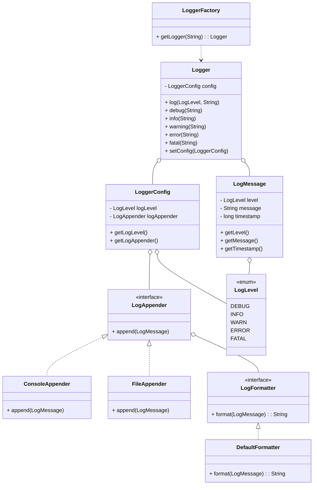

# Logger LLD Implementation

## Problem Statement

Design a flexible and extensible logging system that supports multiple log levels, different output appenders (console, file), and customizable formatting. The system should allow dynamic configuration, thread-safe logging, and be easily extensible for new requirements.

## Requirements

- Support for multiple log levels (DEBUG, INFO, WARN, ERROR, FATAL).
- Pluggable appenders (console, file, etc.).
- Customizable log message formatting.
- Thread-safe logging operations.
- Dynamic logger configuration.
- Logger factory for named loggers.

## How to Run

Use `LoggerDemo.java` to see example usage.

## Design Patterns Used

- **Factory:** `LoggerFactory` provides named logger instances.
- **Strategy:** Log formatting uses the `LogFormatter` interface for flexible message formatting.
- **Strategy:** Log output uses the `LogAppender` interface for flexible output destinations.

## Class Diagram (Generated With AI help)

This diagram covers all main classes: Logger, LoggerConfig, LoggerFactory, LogLevel, LogMessage, LogAppender (and its implementations), LogFormatter (and its implementation).

## How to Extend

- **Add Appenders:** Implement the `LogAppender` interface (e.g., for network, database).
- **Add Formatters:** Implement the `LogFormatter` interface for custom log message formats.
- **Add Log Levels:** Extend the `LogLevel` enum if needed.
