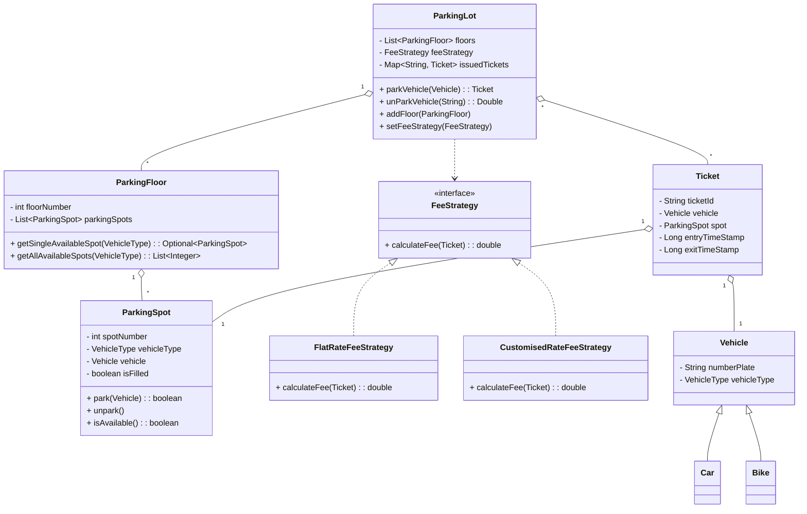

# Parking Lot LLD Implementation

## Problem Statement

Design a parking lot system that supports multiple floors, different vehicle types (Car, Bike), and flexible fee strategies. The system should allow parking, unparking, and fee calculation, and be easily extensible for new requirements.

## Requirements

- Support for multiple floors and parking spots.
- Different vehicle types (Car, Bike).
- Fee calculation strategies (flat rate, customized rate).
- Thread-safe operations for parking/unparking.
- Ticket generation and validation.

## How to Run

Use `Runner.java`

## Design Patterns Used

- **Singleton:** `ParkingLot` ensures only one instance exists.
- **Strategy:** Fee calculation uses the `FeeStrategy` interface for flexible pricing.
- **Factory (Simple):** Vehicle creation via subclasses (`Car`, `Bike`).

## Class Diagram (Generated With AI help)

This diagram covers all main classes: ParkingLot, ParkingFloor, ParkingSpot, FeeStrategy (and its implementations), Ticket, Vehicle (and its subclasses).

## How to Extend

- **Add Vehicle Types:** Create a new subclass of `Vehicle` and update `VehicleType`.
- **Add Fee Strategies:** Implement the `FeeStrategy` interface.
- **Add Features:** Extend `ParkingLot`, `ParkingFloor`, or `ParkingSpot` for new requirements (e.g., reservations, electric charging).
