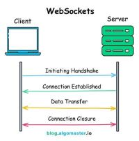
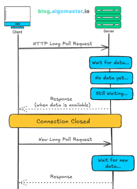
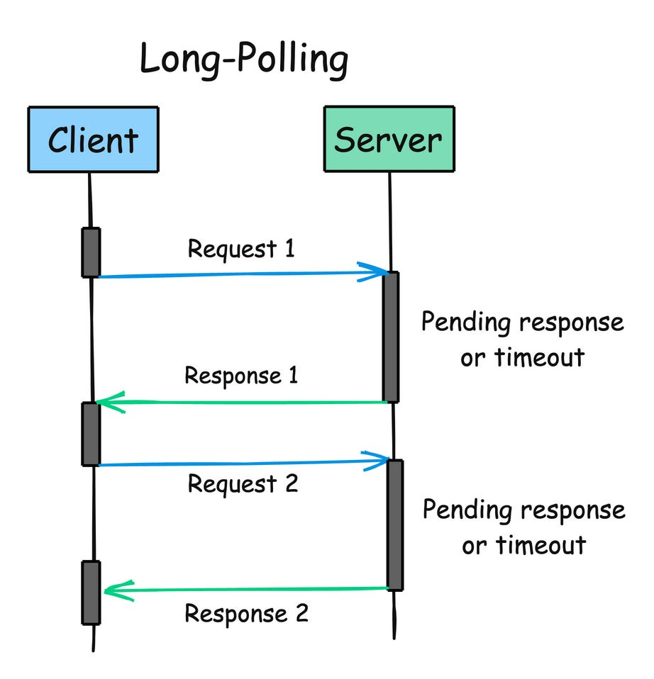

# **Communication**

## **HTTP**

1. HTTP is a method for encoding and transporting data between a client and a server. It is a request/response protocol: clients issue requests and servers issue responses with relevant content and completion status info about the request.
2. HTTP is an application layer protocol relying on lower-level protocols such as **TCP** and **UDP**.

| Verb   | Description                                               | Idempotent\* | Safe | Cacheable                               |
| ------ | --------------------------------------------------------- | ------------ | ---- | --------------------------------------- |
| GET    | Reads a resource                                          | Yes          | Yes  | Yes                                     |
| POST   | Creates a resource or trigger a process that handles data | No           | No   | Yes if response contains freshness info |
| PUT    | Creates or replace a resource                             | Yes          | No   | No                                      |
| PATCH  | Partially updates a resource                              | No           | No   | Yes if response contains freshness info |
| DELETE | Deletes a resource                                        | Yes          | No   | No                                      |

\*Can be called many times without different outcomes.

## Transmission control protocol (TCP)

1. It is a connection oriented protocol. Connection is established and terminated using a handshake.
2. All packets are guaranteed to reach destination in original order by
   1. Checksum
   2. Acknowledgement
3. If sender does not get correct response then it will resend packets
4. All these guarantees causes delays in TCP communication
   Use TCP over UDP when:
   1. You need all of the data to arrive intact
   2. You want to automatically make a best estimate use of the network throughput

## User datagram protocol (UDP)

1. UDP is connectionless. Datagrams (analogous to packets) are guaranteed only at the datagram level. Datagrams might reach their destination out of order or not at all. UDP does not support congestion control. Without the guarantees that TCP support, UDP is generally more efficient.
2. UDP is less reliable but works well in real time use cases such as VoIP, video chat, streaming, and realtime multiplayer games.
3. Use UDP over TCP when:
   1. You need the lowest latency
   2. Late data is worse than loss of data
   3. You want to implement your own error correction

## Remote Procedure Call (RPC)

1. RPC focuses on calling functions (procedures) on a remote server, like calling a local function in code. It is more action-oriented than REST.
2. RPC abstracts the complexity of the communication process, allowing developers to focus on the logic of the procedure.
3. **Key Characteristics**
   1. **Action oriented**
   2. **Function calls** - It allows you to call functions or method directly on a remote server. The client sends a reuest to execute a specific method and server returns the result.
   3. **Synchronous Communication** - Client wait for the server to complete the called procedure.
   4. **Variety of Protocols** - RPC can be implemented using different protocols, such as JSON-RPC, XML-RPC, or gRPC.
   5. **Interface Definition Language** - RPC system often used an IDL to define the interface between client and server.
4. **Advantages**
   1. High Performance
   2. Simpler to implement when need to perform specific actions
   3. More flexible in handeling complex which do not fit CRUD model
5. **Disadvantages**
   1. Tight coupling of client and server
   2. Less standardization
   3. Limited Tooling

## Representational state transfer (REST)

1. It is an architectural style for designing networked applications.
2. **Key Characteristics**
   1. **Stateless**
   2. **Resource oriented** - REST treats everything as a resource, such as users, products, or orders. Each resource is identified by a unique URL.
   3. Leverages Standard HTTP methods
   4. Follow client server architecture
   5. **Cacheable** - REST response can be cached
3. **Advantages**
   1. **Scalability**
   2. **Flexibility** - Allows different data formats likes JSON, XML or plaintext
   3. **Standardization** - follow a standarized approcah that makes them easy to understand
   4. **Wide Adoption**
4. **Disadvantages**
   1. **Verbosity** - when dealing with complex objects or relationships can be verbose
   2. **Over-fetching/Under-fetching**
   3. Inefficient for real-time applications (websockets and gRPC are better)

## Google Remote Procedure Call(gRPC)

1. gRPC is a high-performance, open-source RPC framework that uses Protocol Buffers (Protobuf) for communication instead of JSON. It supports streaming and is widely used in microservices.
2. **Advantages**
   1. **Fast & Efficient** – Uses Protobuf (binary format) instead of JSON, reducing payload size.
   2. **Streaming Support** – Supports real-time communication (unlike REST).
   3. **Strong Typing** – Uses `.proto` files for schema definition
   4. **Great for Microservices** – Optimized for inter-service communication
3. **Disadvantages**
   1. **Not Human-Readable** – Protobuf is binary, making debugging harder.
   2. **More Complex Setup** – Requires defining .proto files and generating client/server code.
   3. **Limited Browser Support** – Requires a gRPC-web proxy to work in web applications.

## GraphQL

1. GraphQL is a query language that allows clients to request exactly the data they need, avoiding over-fetching and under-fetching.
2. **Advantage**
   1. No over/under fetching
   2. Strog typing
   3. Single endpoint
   4. flexible queries - can fetch multiple related resources in one request
3. **Disadvantages**
   1. Complex to learn anf more setup than REST
   2. Caching is harder
   3. Increased server load (as we fetch all data from DB , only we dont send it to client)

## Comparison

| Feature               | REST                   | RPC                           | GraphQL            | gRPC                                 |
| --------------------- | ---------------------- | ----------------------------- | ------------------ | ------------------------------------ |
| **Data Structure**    | Resource-based (nouns) | Function-based (verbs)        | Query-based        | Function-based                       |
| **Communication**     | HTTP (JSON/XML)        | HTTP (JSON)                   | HTTP (JSON)        | HTTP/2 (Protobuf)                    |
| **Performance**       | Medium                 | Medium                        | Medium-High        | High (Binary)                        |
| **Over-fetching**     | Yes                    | Yes                           | No                 | No                                   |
| **Under-fetching**    | Yes                    | Yes                           | No                 | No                                   |
| **Streaming Support** | No                     | No                            | No                 | Yes                                  |
| **Caching**           | Easy (HTTP Caching)    | Hard                          | Hard               | Hard                                 |
| **Best Use Case**     | Web APIs, Public APIs  | Simple actions, Internal APIs | Client-driven APIs | Microservices, High-performance APIs |

## Websockets

1. It enables full-duplex, bidirectional communication between a client over a single TCP connection.

### Working

   

1. **Handshake**
   1. The client initiates connection request using HTTP GET with and `upgrade` header set to `websocket`
   2. if server support ws and accepts the request, it responds with a special `101` statud code, indicating protocol will be changed to websocket.
2. **Connection**
   1. Once handshake complete, the ws connection is established, connection will remain open untill it is closed by either the client and server.
3. **Data transfer**
   1. Both the client and server now sends message in realtime. these messages are sent in small packets called `frames`, and carry minimal overhead compared to HTTP.
4. **Closure**
   1. closed by with a `close` frame.

### Usecase

1. Real time collaboration tools
2. Real time chat apps
3. Live notifications
4. Multiplayer online game
5. Live streaming

### Challenges and Considerations

1. Some Proxy server don't support WS, and some firewall can also block.
2. There should be a `fallback` implemented in case if client or network don't support WS. fallback mechanism can be `long-polling`.
3. Need to secure by authentication and secure ws connection(wss://).

### Long Polling

   

### Polling

   

## WebSocket vs. Long Polling vs. Polling

| Feature                 | WebSocket                                   | Long Polling                            | Polling                        |
| ----------------------- | ------------------------------------------- | --------------------------------------- | ------------------------------ |
| **Communication Type**  | Full-duplex (bidirectional)                 | Half-duplex (client-initiated)          | Half-duplex (client-initiated) |
| **Latency**             | Very low                                    | Medium                                  | High                           |
| **Efficiency**          | High (persistent connection)                | Medium (delayed responses)              | Low (frequent requests)        |
| **Connection Overhead** | Single handshake, then persistent           | New request for each update             | New request for each update    |
| **Server Load**         | Low                                         | Higher than WebSockets                  | Very high                      |
| **Client Requests**     | Only one per session                        | Multiple but less frequent              | Frequent requests              |
| **Best Use Cases**      | Real-time apps (chats, games, live updates) | Notifications, moderate real-time needs | Basic periodic updates         |
| **Scalability**         | High                                        | Moderate                                | Low                            |
