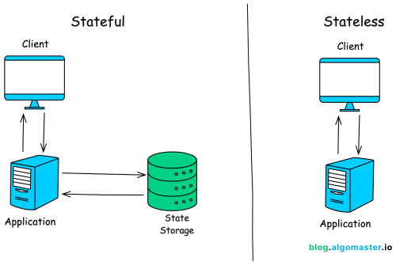

# High level Tadeoffs

## **Performance vs Scalability**

1. If you will have performance issue your system will be slow for a single user
2. if you will have scalability issue your system will be fast for a user but will be slow under heavy load
3. **Performance** refers to how efficiently a system executes tasks under a specific workload. It focuses on response time, throughput and resource usage
4. **Scalability** refers ability of a system to not degrade the performance under increased workload or growing user.

## **Latency vs Throughput**

1. **Latency** is the time it takes a single request to be processed or a task to be completed. typically measured in milliseconds or seconds.
2. **Throughput** refers to the rate at which a system process requests or tasks. typically measured in operations per second (ops), transactions per second.
3. **Generally we thrive for maximal throughput with acceptable latency**

## **Availability vs consistency - see in page [Availability and Consistency](Availability-Consistency.md)**

## **Batch vs Stream Processing**

| Feature             | Batch Processing                                                                 | Stream Processing                                                                       |
| ------------------- | -------------------------------------------------------------------------------- | --------------------------------------------------------------------------------------- |
| **Data Processing** | Processes a large volume of data at once.                                        | Processes data as it arrives, record by record.                                         |
| **Latency**         | High latency, as processing happens after data collection.                       | Low latency, providing near real-time insights.                                         |
| **Throughput**      | Can handle vast amounts of data at once.                                         | Optimized for real-time but might handle less data volume at a given time.              |
| **Use Case**        | Ideal for historical analysis or large-scale data transformations.               | Best for real-time analytics, monitoring, and alerts.                                   |
| **Complexity**      | Relatively simpler to implement with predefined datasets.                        | More complex, requires handling continuous streams.                                     |
| **Data Scope**      | Operates on a finite set of data.                                                | Operates on potentially infinite streams of data.                                       |
| **Error Handling**  | Errors can be identified and corrected before execution.                         | Requires real-time handling of errors and failures.                                     |
| **Resource Usage**  | Resource-intensive during processing, idle otherwise.                            | Continuous use of resources.                                                            |
| **Cost**            | Cost-effective for large volumes of data.                                        | More expensive due to continuous processing.                                            |
| **Tools**           | Apache Hadoop, Apache Spark (Batch Mode), AWS Glue, Google Dataflow (Batch Mode) | Apache Kafka, Apache Flink, Apache Storm, AWS Kinesis, Google Dataflow (Streaming Mode) |

## Stateful vs Stateless Design

   

### Stateless

1. Each request is treated as an independent operation
2. Server doesn't store any information about the client's state between requests.
3. **Advantages**
   1. Scalability - can add multiple server, noneed to maintain session
   2. Simplicity
   3. Resilience - failure on one server won't disrupt user session.
4. **Disadv**
   1. Less context to server about client so personalization is not possible
   2. Every request need some extra data to carry, leading to larger payloads
5. **Examples**
   1. REST APIs
   2. Miscroservices
   3. CDNs

### Stateful

1. System remembers client data from one request to next.
2. It maintains a record of the client's state, which can include session information, transaction details, or any other data relevant to the ongoing interaction.

3. **Advantages**
   1. Personalized experience
   2. Contextual continuity
   3. Reduced payload
4. **Disadv**
   1. Scalability
   2. Failure prone
   3. Complex
5. **Examples**
   1. REST APIs with session storage
   2. In Banking, E-commerce (cart), Multiplayer games
