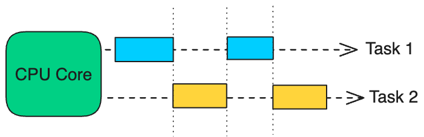
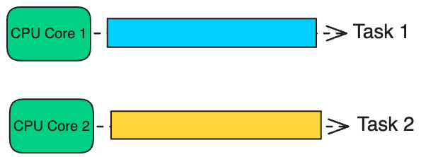
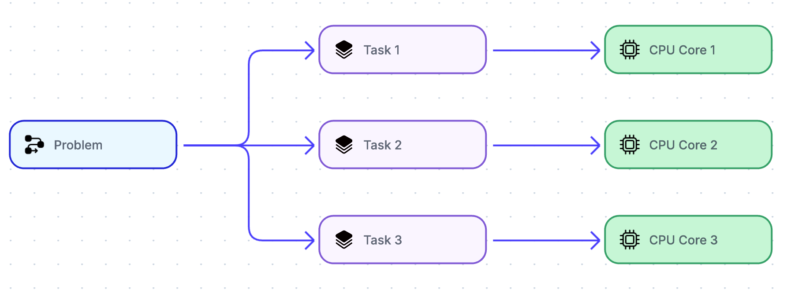

# High level Tadeoffs

## **Performance vs Scalability**

1. If you will have performance issue your system will be slow for a single user
2. if you will have scalability issue your system will be fast for a user but will be slow under heavy load
3. **Performance** refers to how efficiently a system executes tasks under a specific workload. It focuses on response time, throughput and resource usage
4. **Scalability** refers ability of a system to not degrade the performance under increased workload or growing user.

## **Latency vs Throughput**

1. **Latency** is the time it takes a single request to be processed or a task to be completed. typically measured in milliseconds or seconds.
2. **Throughput** refers to the rate at which a system process requests or tasks. typically measured in operations per second (ops), transactions per second.
3. **Generally we thrive for maximal throughput with acceptable latency**

## **Availability vs consistency - see in page [Availability and Consistency](Availability-Consistency.md)**

## **Batch vs Stream Processing**

| Feature             | Batch Processing                                                                 | Stream Processing                                                                       |
| ------------------- | -------------------------------------------------------------------------------- | --------------------------------------------------------------------------------------- |
| **Data Processing** | Processes a large volume of data at once.                                        | Processes data as it arrives, record by record.                                         |
| **Latency**         | High latency, as processing happens after data collection.                       | Low latency, providing near real-time insights.                                         |
| **Throughput**      | Can handle vast amounts of data at once.                                         | Optimized for real-time but might handle less data volume at a given time.              |
| **Use Case**        | Ideal for historical analysis or large-scale data transformations.               | Best for real-time analytics, monitoring, and alerts.                                   |
| **Complexity**      | Relatively simpler to implement with predefined datasets.                        | More complex, requires handling continuous streams.                                     |
| **Data Scope**      | Operates on a finite set of data.                                                | Operates on potentially infinite streams of data.                                       |
| **Error Handling**  | Errors can be identified and corrected before execution.                         | Requires real-time handling of errors and failures.                                     |
| **Resource Usage**  | Resource-intensive during processing, idle otherwise.                            | Continuous use of resources.                                                            |
| **Cost**            | Cost-effective for large volumes of data.                                        | More expensive due to continuous processing.                                            |
| **Tools**           | Apache Hadoop, Apache Spark (Batch Mode), AWS Glue, Google Dataflow (Batch Mode) | Apache Kafka, Apache Flink, Apache Storm, AWS Kinesis, Google Dataflow (Streaming Mode) |

## Stateful vs Stateless Design

   

### Stateless

1. Each request is treated as an independent operation
2. Server doesn't store any information about the client's state between requests.
3. **Advantages**
   1. Scalability - can add multiple server, noneed to maintain session
   2. Simplicity
   3. Resilience - failure on one server won't disrupt user session.
4. **Disadv**
   1. Less context to server about client so personalization is not possible
   2. Every request need some extra data to carry, leading to larger payloads
5. **Examples**
   1. REST APIs
   2. Miscroservices
   3. CDNs

### Stateful

1. System remembers client data from one request to next.
2. It maintains a record of the client's state, which can include session information, transaction details, or any other data relevant to the ongoing interaction.
3. **Advantages**

   1. Personalized experience
   2. Contextual continuity
   3. Reduced payload

4. **Disadv**

   1. Scalability
   2. Failure prone
   3. Complex

5. **Examples**

   1. REST APIs with session storage
   2. In Banking, E-commerce (cart), Multiplayer games

## Concurrency vs Parallelism

Concurrency is about managing multiple tasks simultaneously, while Parallelism is about executing multiple tasks at the same time.

### Concurrency

   

1. Concurrency means an application is making progress on more than one task at the same time.
2. Even on a single CPU core. This is achieved through context switching, where the CPU rapidly switches between tasks, giving the illusion of simultaneous execution.
3. This seamless switching—enabled by modern CPU designs—creates the illusion of multitasking and gives the appearance of tasks running in parallel.
4. The primary objective of concurrency is to maximize CPU utilization by minimizing idle time.
5. Cost : Although Context switching enables concurrency but it also introduce overhead
   1. every switch require saving and restoring task states
6. **Examples**
   1. Modern web browsers perform multiple task concurrently (like loading html/css, responding user clicks etc.)
   2. Used in web servers handling multiple client requests, even on a single CPU.
   3. Chat apps

### Parallelism

   

   

1. Multiple tasks are executed simultaneously.
2. To achieve parallelism, an application divides its tasks into smaller, independent subtasks. These subtasks are distributed across multiple CPUs, CPU cores, GPU cores, or similar processing units, allowing them to be processed in parallel.
3. Modern CPUs consist of multiple cores. Each core can independently execute a task. Parallelism divides a problem into smaller parts and assigns each part to a separate core for simultaneous processing.
4. **Examples**
   1. ML training - train modesls by dividing datasets into smaller batches
   2. Web crawlers - breaks list of URls into smaller chunks and process in parallel
   3. Data processing

| **Aspect**               | **Concurrency**                                                                             | **Parallelism**                                                              |
| ------------------------ | ------------------------------------------------------------------------------------------- | ---------------------------------------------------------------------------- |
| **Execution**            | Achieved through context switching on a single core or thread.                              | Requires multiple cores or processors to execute tasks simultaneously.       |
| **Focus**                | Managing multiple tasks and maximizing resource utilization.                                | Splitting a single task into smaller sub-tasks for simultaneous execution.   |
| **Use Case**             | Best suited for I/O-bound tasks like handling multiple network requests or file operations. | Ideal for CPU-bound tasks like data processing or machine learning training. |
| **Resource Requirement** | Can be implemented on a single core or thread.                                              | Requires multiple cores or threads.                                          |
| **Outcome**              | Improves responsiveness by efficiently managing task switching.                             | Reduces overall execution time by performing tasks simultaneously.           |
| **Examples**             | Asynchronous APIs, chat applications, or web servers handling multiple requests.            | Video rendering, machine learning training, or scientific simulations.       |
| **Analogy**              | A single chef multitasking—preparing multiple dishes by working on them in parts.           | Multiple chefs working on different dishes at the same time.                 |
