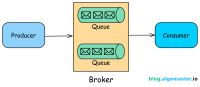
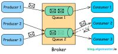
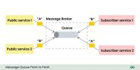
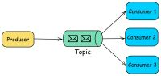
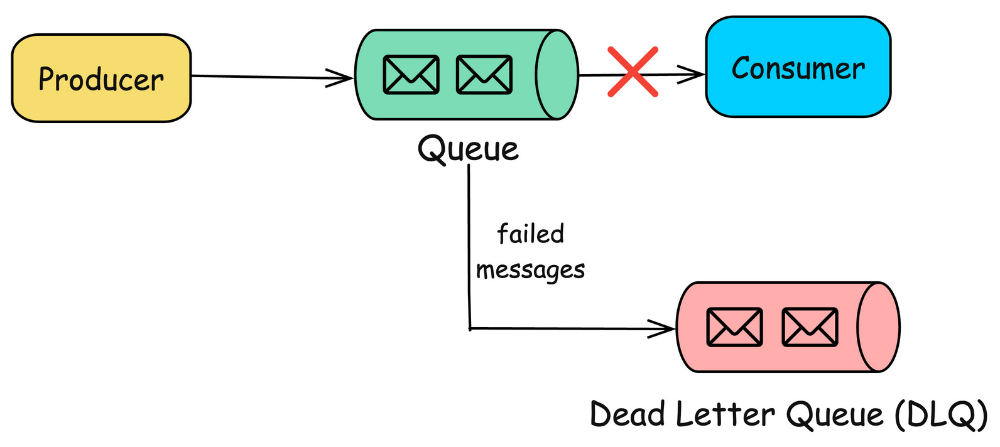

## Message Queues

1. It is a communication mechanism that allows different parts of the system to send and receive messages asynchronously.
2. It acts as a **intermediary** which holds message sent from producer(or publisher) and delivers them to subscribers(or consumer).
3. It is a decoupled architecture where publisher and subscribers are not aware of each other.

### **Components**

1. **Publisher** - entity that sends messages to queue
2. **Subscriber** - entity that reads message from queue
3. **Queue** - Data structure that stores message untill they are consumed
4. **Broker** - It is optional in some. It is a software that manages the message queues, handles that message are routed correctly between consumers and producers.
5. **Message** - a unit of data sent. generally contains some payload, metadata (headers, timestamps, priority) about the message.

### **How does Message Queues work**

1. **Sending Message**
2. **Queueing Message**
3. Queue stores the message temporarily, making available for one or more consumer
4. **Consuming Message**
5. Message consumers retrieve messages from the queue when they are ready to process them. They can do this at their own pace, which enables asynchronous communication.
6. **Acknowledgement (Optional)**
7. In some message queue systems, consumers can send acknowledgments back to the queue, indicating that they have successfully processed a message. This is essential for ensuring message delivery and preventing message loss.

### **Types**

1. **Point to Point Queue**

   

   1. It is simplest type. When a producer sends a message the message is stored in the queue untill the consumer retrieves it.
   2. Once message is retrieved it is removed from the queue and can not be processed by another consumer.
   3. **Used in**
      1. Task processing system
      2. Log processing system
      3. Order processing system

2. **Publish/Subscribe (Pub/Sub) Queue**

   

   1. In this model, messages are published to a topic and multiple consumers can subscribe to that topic to receive messages.
   2. Publishes messages to a topic instead of directly sending them to a queue.
   3. A Message Broker (Pub/Sub system) is a central system (e.g., Kafka, Google Pub/Sub, Redis) that distributes messages from publishers to all subscribed consumers.
   4. Subscribers receive messages
      Any service subscribed to the topic will get the message.
   5. **Usecase**
      1. Inventory Service → Updates stock
      2. Payment Service → Processes the payment
      3. Shipping Service → Starts delivery
      4. Notification Service → Sends email/SMS confirmation

3. **Priority Queue**

   1. Messages in the queue are assigned priorities, and higher-priority messages are processed before lower-priority ones.
   2. **Usecase**
      1. emergency alerts system
      2. Healthcare (critical patients alert)
      3. Customer support system(e.g. premium customer get faster response)

4. **Dead Letter Queue (DLQ)**

   

   1. Stores messages that could not be processed successfully after multiple retries.
   2. **Usecase**
      1. Handeling failed transaction in e-commerce
      2. Useful for troubleshooting and handeling failed messages

### **Advantages**

1. **Decopling**
   1. producer and consumer are decoupled
2. **Ashynchronous Processing**
   1. producer can send message to queue and move on to other task. similarly consumer can consume message based on availability.
3. **Fault tolerance**
   1. Persistent queues ensure that messages not lost even if consumer fails. they also allow reties and error handling.
4. **Scalability**
   1. Can scale horizontally adding more consumers and producers
5. **Throttling**
   1. This can control rate of message processing, preventing consumer from being overloaded.

### **When to use**

1. **Microservice architecture**
   1. MS need to communicate to each other but direct calling can lead to tight coupling and cascading failure.
2. **Task scheduling and Background processing**
   1. Certain tasks, such as image processing or sending emails, are time-consuming and should not block the main application flow. Offload these tasks to a message queue and have background workers (consumers) process them asynchronously.
3. **Event driven architecture**
   1. Event needs to propagated to multiple services but direct communication can lead to tight coupling so we can use a Pub/Sub queue to broadcast event to all interested consumer services.
4. **Reliable communication**
   1. Using persistent and retry handeled queue can make reliable communication.
5. **Load leveling**
   1. Sudden spikes in requests can overwhelm a system, leading to degraded performance or failures. Queue incoming requests using a message queue and process them at a steady rate, ensuring that the system remains stable under load.

### **Best practices for implementing**

1. **Idempotency**
   1. Ensure that duplicate messages are handled correctly.
2. **Message Durability**
   1. Based on usecase implement persistent or transient messages. as persistent comes with some tradeoff.
3. **Error Handeling**
   1. Implement robust error handling by including retirs, DLQ, and alerting mechanism for failed message processing.
4. **Security**
   1. Implement security by encryption, authentication.
5. **Monitoring**
   1. Setup monitoring to check performance and health of the message queues, including throughput, queue length, and consumer lag.
6. **Scalability**

### **Popular Message Queue**

1. **Apache Kafka**
   1. It is distributed streaming platform that excels at handling large volumes of data. Most widely used for high throughput and event driven systems.
2. **RabbitMQ**
   1. widely used open source message broker that supports multiple messaging protocols, including AMQP. Supports P2P, Pub/Sub, Priority.
3. **Google Cloud Pub/Sub**
   1. A fully managed message queue service offered by Google Cloud, designed for real-time analytics and event-driven applications.
4. **Amazon SQS**
   1. A fully managed message queue service provided by AWS. SQS is highly scalable and integrates well with other AWS services.
