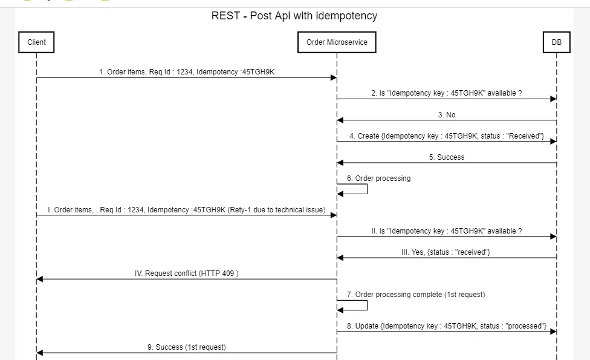

# Idempotency in Distributed System

   

1. In certain scenarios we need a operation to produce same result even if it is called multiple times. this property is called Idempotency.
2. It is used as suppose for a payment processing system the call fails for client but it is submitted successfully on Backend, then when user will retry the request will be submitted again and user will be charged twice.

## Ways to Implement

### Unique Request Identifier with Idempotency Key

1. **Working**
   1. The client generates a unique key (may be UUID) for each operation and send it in the request header.
   2. Server stores the key and response in a central DB like redis (for DS)
   3. if a request with same key found again server return response that is cached instead of procesing again.
2. **Usecase**
   1. API based transactions
   2. retry handeling
3. **Disadv**
   1. Require Persistent storage
   2. Needs key expiry handeling

### In messaging system

1. In a messaging system, we can enforce idempotency by storing a log of processed message IDs and checking against it for every incoming message.
2. Each message has a unique messageId. Before processing, we check if the messageId is already in processedMessages. If it is, the message is ignored; otherwise, it’s processed and added to the set to avoid duplicates.

### In HTTP Methods

1. GET, PUT, DELETE are idempotent
2. POST is not idempotent

### Some other ways

1. Enforce unique constraints on database fields (e.g., unique transaction_id). If a duplicate request tries to insert the same record, the DB rejects it.
2. Instead of a client-generated key, the server generates a hash of the request payload. If the same hash is detected again, the request is considered a duplicate.
3. Before processing a request, a lock is acquired. If the same request is received while the lock is active, it is rejected.

## Challenges and Consideration

1. **Distributed Systems:** Ensuring idempotency across distributed systems can be challenging and may require distributed locking or consensus algorithms.
2. **Time Window:** How long should idempotency guarantees be maintained? Forever, or for a limited time?
3. **Database Constraints:** Not all operations are idempotent by default; unique constraints or upsert logic may be necessary to avoid duplication.
4. **Performance Overhead:** Storing idempotency keys or checking for duplicate operations can add overhead and increase the overall latency.

## Best Practices

1. Use Unique Identifier (UUID or user-based)
2. Design for idempotency from start
3. Implement retry with backoff
