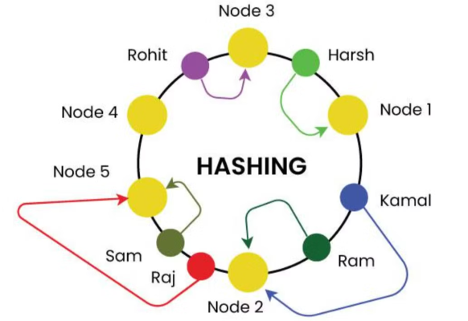

# Consistent Hashing

 

1. In normal (modulo system) if we try to scale down or up a system we need to update the system space again which require lot of time and resource.

2. Here the node(servers) and users(request) are put on the same ring, and whenever a request comes we traverse clockwise which ever server is found first that will serve the request.

## Adding a new Node

1. When there is a scale-up a node need to be add in the system we do these steps
   1. find the position of the node where it resides in hash space
   2. populate the new node with data it supposed to serve
   3. Add node in hash space
2. When a new node added it only affects the files that hash at the location to the left and associated with the node to right.
3. All other files and associations remain unaffected, thus minimizing the amount of data to be migrated and mapping required to be changed.
4. Consistent Hashing on an average requires only `k/n` units of data to be migrated during scale up and down; where `k` is the total number of keys and `n` is the number of nodes in the system.

## Removing a Node

1. When there is a need to scale down and remove an existing node from the system, we
   1. find the position of the node to be removed from the Hash Space
   2. populate the node to the right with data that was associated with the node to be removed
   3. remove the node from the Hash Space
2. When a node is removed from the system it only affects the files associated with the node itself. All other files and associations remain unaffected, thus minimizing the amount of data to be migrated and mapping required to be changed.

## Associating an item to a Node

## Usecases

1.  Consistent hashing minimizes data movement when nodes join/leave.
2.  Real-world applications include caching, databases, load balancing, P2P networks, and decentralized storage.

## Edge Cases Handeling

1. **Uneven Distribution of Keys**

   1. **Problem**
      1. If notes not evenly distributed then one node can have more data than others.
      2. This can create hotspots, where some nodes get overloaded while other remains underutilized.
   2. **Solution**
      1. Instead of assigning a single position to each node, each node gets multiple positions(virtual nodes) in thr ring.
      2. This ensures that data is evenly spread across nodes, preventing hotspots.

2. **Single Node failure**
   1. If one node fail all data of that will go to next node and this can lead to overload.
   2. Solution for this problem is also **virtual nodes**.
