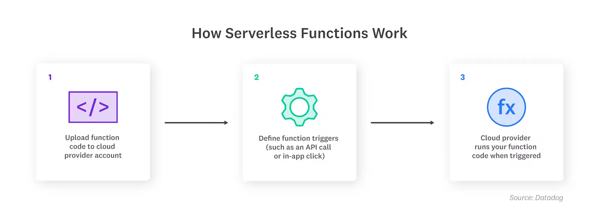

# Serverless Architecture

1. It is a approach that allows developers to build and run services without having to manage the underlying infra.
2. Developers just write thier codr and deploy, while a cloud provider provisions server to run their applications, databases and storage systems at any scale.

## Working

1. One of the most popular serverless architectures is Function as a Service (FaaS), where developers write their application code as a set of discrete functions. Each function will perform a specific task when triggered by an event, such as an incoming email or an HTTP request. After the customary stages of testing, developers then deploy their functions, along with their triggers, to a cloud provider account. When a function is invoked, the cloud provider either executes the function on a running server, or, if there is no server currently running, it spins up a new server to execute the function. This execution process is abstracted away from the view of developers, who focus on writing and deploying the application code.
2. There are some other popular are serverless containers.

## Benefits

1. Cost efficiency (Pay per use)
2. Scalability (Auto scaling)
3. Developer Productivity (Focus on code)
4. Resilience and Availability
   1. each function/container run in isolation
   2. built-in fault tolerance

## Challenges and Considerations

1. **Cold start latency**
   1. First invocation of a function after a long period of inactivity can experience a higher latency.
   2. Can be mitigated by using techinques like function warmer, Provisioned concurrency.
2. **Complexity in State Management**
   1. Since serverless functions are stateless, managing state across multiple sessions can be challenging.
3. **Vendor Lock-In**
   1. Heavily rely on services provided by a vendor.
   2. can mitigate using a open source serverless framework like Knative.
4. **Debugging and Monitoring**
5. **Resource Limits**
   1. Serverless functions generally have execution time limit(e.g. 15 minutes for AWS lambda).

## Common Usecase

1. Web application
2. Data processing
3. Event-Driven Automation: Serverless functions can automate routine tasks such as backups, monitoring, and notifications based on predefined events.
4. Devops and CI/CD

## Examples

1. Google Cloud Functions
2. AWS Lambda
3. Micrisoft Azure functions
