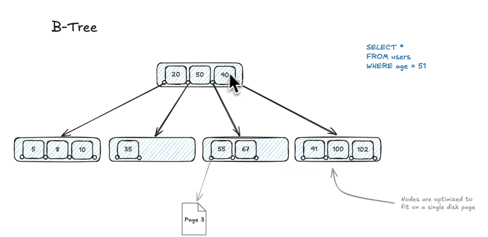
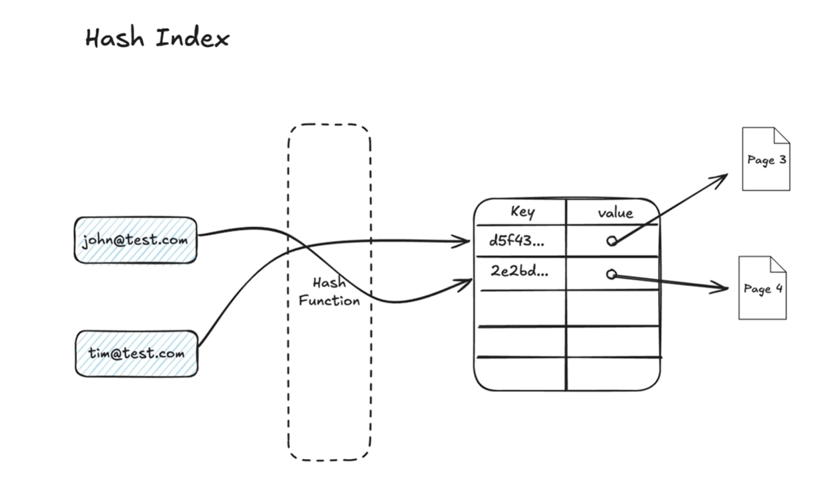
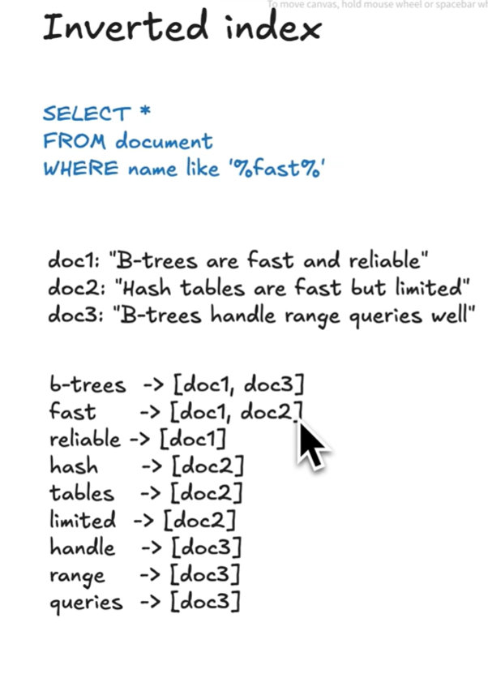
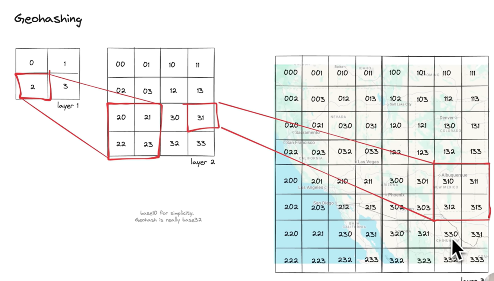

# 📚 Database Indexes

Indexes improve query performance by allowing databases to locate rows faster without scanning every record.

---

## 🧩 What is a Database Index?

An index is a **data structure** that helps locate rows quickly based on column values, similar to a book index.

Without an index → Full table scan (O(n))
With an index → Tree or hash lookup (O(log n) or O(1))

---

## 🧠 Common Index Data Structures

| Type                        | Used By                     | Description                                              | Time Complexity  |
| --------------------------- | --------------------------- | -------------------------------------------------------- | ---------------- |
| **B-Tree / B+ Tree**        | MySQL, Postgres             | Balanced tree keeping keys sorted                        | O(log n)         |
| **Hash Index**              | Postgres, Redis             | Hash table for exact matches                             | O(1)             |
| **Bitmap Index**            | ClickHouse, Oracle          | Bit arrays for low-cardinality data                      | Bit ops          |
| **Inverted Index**          | ElasticSearch               | Term → document mapping                                  | O(log n)         |
| **GeoSpatial index**        | Spatial databases           | Multi-dimensional data (2D/3D)                           | -                |
| **GiST / GIN / SP-GiST**    | PostgreSQL                  | Specialized trees for complex data                       | varies           |
| **Clustered Index**         | MySQL (InnoDB)              | Data physically ordered by key                           | O(log n)         |
| **Non-Clustered Index**     | Most RDBMS                  | Separate index pointing to data                          | O(log n)         |
| **Global Sec. Index (GSI)** | NoSQL (DynamoDB, Cassandra) | Replicated, separately partitioned data index            | O(1) or O(log n) |
| **Local Sec. Index (LSI)**  | NoSQL (DynamoDB)            | Index sharing the main partition key with a new sort key | O(1) or O(log n) |

---

## 🔍 Index Types and Use Cases

### 1. B+ Tree Index

- **Use case:** Range queries (`>`, `<`, `BETWEEN`), sorting, prefix match.
- **Tech:** Balanced tree, keys in internal nodes, data in leaf nodes.
- **Used by:** MySQL, Postgres (default).

---

### 2. Hash Index

- **Use case:** Exact match (`=`) lookups.
- **Tech:** Hash table mapping key → row pointer.
- **Limitation:** Not suitable for range queries.

### 3. Bitmap Index

- **Use case:** Low-cardinality columns like `gender`, `status`.
- **Tech:** Bit vectors for each unique value; uses bitwise ops for filtering.
- **Used by:** Analytics DBs like Oracle, ClickHouse.

---

### 4. Inverted Index

- **Use case:** Full-text search, tokenized matching.
- **Tech:** Maps terms → list of document IDs containing them.
- **Used by:** Elasticsearch, Solr.

---

### 5. Geospatial Index

- **Use case:** Spatial/geolocation queries.
- **Tech:** Bounding rectangles to group nearby coordinates.
- **Types:**
  - GeoHashing
  - Quad Tree
  - R Tree

### 6. GiST / GIN / SP-GiST (PostgreSQL)

| Type        | Use Case                          | Description                |
| ----------- | --------------------------------- | -------------------------- |
| **GiST**    | Ranges, geometric, fuzzy matching | Extensible balanced tree   |
| **GIN**     | Full-text search, JSONB keys      | Multi-value indexing       |
| **SP-GiST** | IP ranges, quadtrees              | Space-partitioned indexing |

---

### 7. Clustered vs Non-Clustered Index

| Type              | Description                                              | Example               |
| ----------------- | -------------------------------------------------------- | --------------------- |
| **Clustered**     | Data physically ordered by index key (only one allowed). | Primary key in InnoDB |
| **Non-Clustered** | Separate structure pointing to data (many allowed).      | Secondary indexes     |

---

### 8. Distributed & NoSQL Indexes (GSI and LSI)

Distributed systems partition (shard) data across separate physical nodes using a **Partition Key** to scale horizontally. Standard single-server indexing "pointer maps" fail here because following a pointer would require slow, unpredictable inter-node network hops.

#### Global Secondary Index (GSI)

- **Use case:** Querying distributed tables using non-primary keys (e.g., finding a user by `email` instead of `user_id`) without performing an expensive all-node scan.
- **Tech:** **Full Table Replication**. A completely separate shadow table is stood up, partitioned by the new secondary key field.
- **Behavior:** Main table writes asynchronously propagate to the GSI table via background event streams, making GSIs **eventually consistent**.
- **Used by:** DynamoDB, Cassandra, ScyllaDB (and conceptually simulated via manual Lookup Tables or Sharding tools like Vitess/Citus in relational SQL environments).

#### Local Secondary Index (LSI)

- **Use case:** Sorting or filtering alternate fields within a specific partition container.
- **Tech:** **Local Pointer Map**. It must share the exact same Partition Key as the parent table but registers a different Sort Key.
- **Behavior:** Stored locally on the exact same physical node as the main partition row data, enabling **strongly consistent** reads without cross-network penalties.

---

## 📊 Summary Table

| Index Type           | Use Case                      | Pros                                  | Cons                                                                |
| -------------------- | ----------------------------- | ------------------------------------- | ------------------------------------------------------------------- |
| **B+ Tree**          | Range queries                 | Balanced, ordered                     | Slower for exact match                                              |
| **Hash**             | Exact match                   | Fast lookup                           | No range, rehash overhead                                           |
| **Bitmap**           | Low-cardinality               | Fast filters                          | Bad for frequent writes                                             |
| **Inverted**         | Full-text                     | Fast search                           | Large space                                                         |
| **GiST/GIN/SP-GiST** | Specialized                   | Versatile                             | Higher write cost                                                   |
| **Clustered**        | Primary key                   | Fast range reads                      | Table reorder costly                                                |
| **Non-Clustered**    | Secondary                     | Multiple allowed                      | Extra I/O hop                                                       |
| **GSI (Global)**     | Distributed Non-PK Lookup     | Fast single-node cross queries        | Asynchronous / Eventual consistency, extra storage, dual write cost |
| **LSI (Local)**      | Alternate Sort inside a Shard | Strong consistency, localized storage | Limited to the same partition boundary                              |

---

## 💡 Key Takeaways

- Indexes speed up reads but **slow down writes**.
- Choose index type based on query pattern:
  - Equality → **Hash**
  - Range → **B+ Tree**
  - Analytics → **Bitmap**
  - Full-text → **Inverted**
  - Spatial → **GeoHashing / Quad Tree / R Tree**
  - Distributed NoSQL (Cross-Node Lookup) → **GSI**
  - Distributed NoSQL (Intra-Node Sort) → **LSI**

---

## Quick decision making

   

