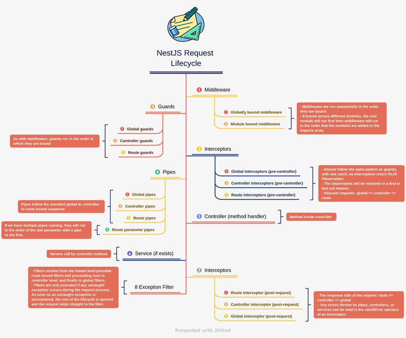

# NestJS Request Lifecycle: Complete Guide

## Table of Contents

1. [Overview](#overview)
2. [The Complete Flow](#the-complete-flow)
3. [Detailed Breakdown](#detailed-breakdown)
4. [Execution Context](#execution-context)
5. [Common Gotchas](#common-gotchas)
6. [Practical Examples](#practical-examples)
7. [Performance Considerations](#performance-considerations)

---

## Overview

The NestJS request lifecycle is the journey a request takes from entry point to response. Understanding this flow is critical for debugging, optimization, and building robust applications.

### Key Players in the Lifecycle

| Component                       | Role                                        | Common Use Cases                                                                                            |
| ------------------------------- | ------------------------------------------- | ----------------------------------------------------------------------------------------------------------- |
| **Middleware**                  | Runs first, can access raw request/response | CORS headers, compression, body parsing, request ID tracking, rate limiting, security headers (Helmet)      |
| **Guards**                      | Authorization checks, runs after middleware | JWT/token validation, role-based access (RBAC), permission checks, API key validation, owner verification   |
| **Interceptors (pre-handler)**  | Pre-processing, request transformation      | Request logging, encryption/decryption, input sanitization, context injection, multi-tenant routing         |
| **Pipes**                       | Data validation and transformation          | Type coercion (parseInt), DTO validation, UUID validation, enum validation, recursive object transformation |
| **Route Handler**               | Business logic execution                    | CRUD operations, complex workflows, data aggregation, multi-step operations, async processing               |
| **Interceptors (post-handler)** | Response transformation                     | Response wrapping, encryption, sensitive field filtering, pagination formatting, cache headers              |
| **Exception Filters**           | Error handling and response transformation  | Global error handling, validation errors, database errors, timeout errors, structured error logging         |

---

## The Complete Flow

```
REQUEST ARRIVES
    ↓
MIDDLEWARE (ordered globally)
    ↓
GUARDS (order matters!)
    ↓
GLOBAL INTERCEPTORS (before handler)
    ↓
CONTROLLER-LEVEL INTERCEPTORS (before handler)
    ↓
METHOD-LEVEL INTERCEPTORS (before handler)
    ↓
GLOBAL PIPES (validation)
    ↓
CONTROLLER-LEVEL PIPES
    ↓
METHOD-LEVEL PIPES
    ↓
ROUTE HANDLER EXECUTES
    ↓
METHOD-LEVEL INTERCEPTORS (after handler)
    ↓
CONTROLLER-LEVEL INTERCEPTORS (after handler)
    ↓
GLOBAL INTERCEPTORS (after handler)
    ↓
EXCEPTION FILTERS (if error)
    ↓
RESPONSE SENT
```

---



## Detailed Breakdown

### 1. Middleware

**What it does:** First step in processing; has direct access to Node.js request/response objects.

```typescript
// logger.middleware.ts
import { Injectable, NestMiddleware } from '@nestjs/common';
import { Request, Response, NextFunction } from 'express';

@Injectable()
export class LoggerMiddleware implements NestMiddleware {
  use(req: Request, res: Response, next: NextFunction) {
    console.log(`[${new Date().toISOString()}] ${req.method} ${req.path}`);
    // You can modify req/res here
    req.userId = 123; // Custom property
    next();
  }
}

// app.module.ts
export class AppModule implements NestModule {
  configure(consumer: MiddlewareConsumer) {
    consumer.apply(LoggerMiddleware).forRoutes('*'); // Apply to all routes
  }
}
```

**Gotcha:** Middleware doesn't have access to NestJS dependency injection context directly. You need to inject dependencies separately.

---

### 2. Guards

**What it does:** Authorization layer; determines if a request can proceed.

```typescript
// auth.guard.ts
import {
  Injectable,
  CanActivate,
  ExecutionContext,
  UnauthorizedException,
} from '@nestjs/common';

@Injectable()
export class AuthGuard implements CanActivate {
  canActivate(context: ExecutionContext): boolean {
    const request = context.switchToHttp().getRequest();
    const token = request.headers.authorization;

    if (!token) {
      throw new UnauthorizedException('Missing token');
    }

    // Verify token logic
    return true;
  }
}

// user.controller.ts
@Controller('users')
export class UserController {
  @Get()
  @UseGuards(AuthGuard)
  getUsers() {
    return 'All users';
  }
}
```

**Gotcha:** Guards execute in order of registration. If you have multiple guards, the first one to return `false` or throw an exception stops the chain.

```typescript
// Multiple guards - execution order matters!
@UseGuards(AuthGuard, AdminGuard, PermissionGuard)
getSecretData() {}
// If AuthGuard fails, AdminGuard and PermissionGuard never run
```

---

### 3. Interceptors (Pre-Handler)

**What it does:** Pre-processes the request before it reaches the handler.

```typescript
// request-logging.interceptor.ts
import {
  Injectable,
  NestInterceptor,
  ExecutionContext,
  CallHandler,
} from '@nestjs/common';
import { Observable } from 'rxjs';
import { tap } from 'rxjs/operators';

@Injectable()
export class RequestLoggingInterceptor implements NestInterceptor {
  intercept(context: ExecutionContext, next: CallHandler): Observable<any> {
    const request = context.switchToHttp().getRequest();
    const startTime = Date.now();

    console.log(`Before handler: ${request.method} ${request.path}`);

    return next.handle().pipe(
      tap(() => {
        const duration = Date.now() - startTime;
        console.log(`After handler: Took ${duration}ms`);
      }),
    );
  }
}

// app.module.ts
@Module({
  providers: [
    {
      provide: APP_INTERCEPTOR,
      useClass: RequestLoggingInterceptor,
    },
  ],
})
export class AppModule {}
```

**Gotcha:** Interceptors are executed in a specific order:

- Global interceptors first (in order of registration)
- Then controller-level interceptors
- Then method-level interceptors

The "after handler" phase runs in **reverse** order. (First In Last Out)

---

### 4. Pipes

**What it does:** Validates and transforms data.

```typescript
// parse-int.pipe.ts
import { PipeTransform, Injectable, BadRequestException } from '@nestjs/common';

@Injectable()
export class ParseIntPipe implements PipeTransform<string, number> {
  transform(value: string): number {
    const val = parseInt(value, 10);
    if (isNaN(val)) {
      throw new BadRequestException('Invalid integer');
    }
    return val;
  }
}

// user.controller.ts
@Controller('users')
export class UserController {
  @Get(':id')
  getUser(@Param('id', ParseIntPipe) id: number) {
    // id is now guaranteed to be a number
    return `User ${id}`;
  }
}
```

**Gotcha:** Pipes run on **each parameter** independently. If you have multiple parameters with the same pipe, it runs multiple times.

```typescript
// Pipe runs 3 times (once per parameter)
@Post()
create(
  @Body('name', ValidationPipe) name: string,
  @Body('email', ValidationPipe) email: string,
  @Body('age', ParseIntPipe) age: number,
) {}
```

---

### 5. Route Handler

```typescript
@Controller('users')
export class UserController {
  constructor(private userService: UserService) {}

  @Get(':id')
  @UseGuards(AuthGuard)
  @UseInterceptors(CacheInterceptor)
  async getUser(@Param('id', ParseIntPipe) id: number) {
    // At this point:
    // - Authorization is confirmed
    // - Request is logged
    // - ID is validated and typed as number
    return this.userService.findById(id);
  }
}
```

---

### 6. Interceptors (Post-Handler)

Processes the response after the handler completes.

```typescript
// response-transform.interceptor.ts
import {
  Injectable,
  NestInterceptor,
  ExecutionContext,
  CallHandler,
} from '@nestjs/common';
import { Observable } from 'rxjs';
import { map } from 'rxjs/operators';

@Injectable()
export class ResponseTransformInterceptor implements NestInterceptor {
  intercept(context: ExecutionContext, next: CallHandler): Observable<any> {
    return next.handle().pipe(
      map((data) => ({
        success: true,
        data,
        timestamp: new Date().toISOString(),
      })),
    );
  }
}

// Usage
@Controller('users')
@UseInterceptors(ResponseTransformInterceptor)
export class UserController {
  @Get()
  getUsers() {
    return [{ id: 1, name: 'John' }]; // Response gets wrapped
  }
}

// Response to client:
// {
//   "success": true,
//   "data": [{ "id": 1, "name": "John" }],
//   "timestamp": "2024-01-15T10:30:00.000Z"
// }
```

---

### 7. Exception Filters

**What it does:** Catches thrown exceptions and formats the HTTP response.

```typescript
// all-exceptions.filter.ts
import {
  ExceptionFilter,
  Catch,
  ArgumentsHost,
  HttpException,
  HttpStatus,
} from '@nestjs/common';
import { Request, Response } from 'express';

@Catch()
export class AllExceptionsFilter implements ExceptionFilter {
  catch(exception: unknown, host: ArgumentsHost) {
    const ctx = host.switchToHttp();
    const response = ctx.getResponse<Response>();
    const request = ctx.getRequest<Request>();

    const status =
      exception instanceof HttpException
        ? exception.getStatus()
        : HttpStatus.INTERNAL_SERVER_ERROR;

    const message =
      exception instanceof HttpException
        ? exception.getResponse()
        : 'Internal server error';

    response.status(status).json({
      statusCode: status,
      timestamp: new Date().toISOString(),
      path: request.url,
      message,
    });
  }
}
```

// Usage examples

```typescript
// 1) Global filter in main.ts
const app = await NestFactory.create(AppModule);
app.useGlobalFilters(new AllExceptionsFilter());
await app.listen(3000);
```

```typescript
// 2) Controller-level filter
@Controller('users')
@UseFilters(AllExceptionsFilter)
export class UserController {
  @Get()
  getUsers() {
    throw new Error('boom');
  }
}
```

```typescript
// 3) Method-level filter
@Controller('users')
export class UserController {
  @Get()
  @UseFilters(AllExceptionsFilter)
  getUsers() {
    throw new Error('boom');
  }
}
```

**Gotcha:** Exception filters only run after an exception is thrown, and they are not a substitute for validation logic in pipes or permission logic in guards.

---
