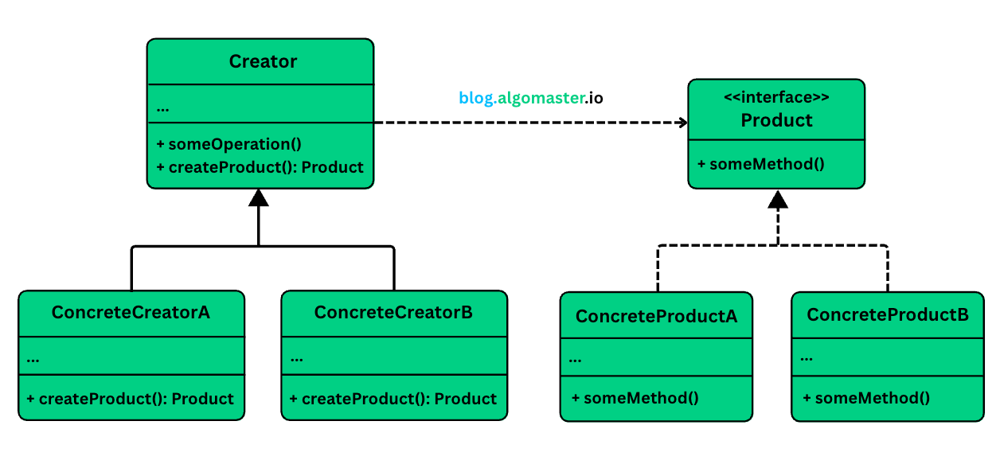

# Factory Method Design Pattern

It is a creational design pattern that provides an interface for creating objects in superclass, but allows subclasses to alter the type of objects that will be created.

## Problem we have initially

1. Suppose we are building a notification service initially it will look like this

   ```
   public class NotificationService{
       public void sendNotif(String msg){
           EmailNotification email = new EmailNotification();
           email.send(msg);
       }
   }
   ```

2. but the problem if above is if in future we want to extend to SMS, Slack ...etc notif then our class will look like

   ```
   public class NotificationService{
       public void sendNotif(String type,String msg){
           if(type.equals("Email")){
               EmailNotification email = new EmailNotification();
               email.send(msg);
           } else if(type.equals("SMS")){
               SMSNotification sms = new SMSNotification();
               sms.send(msg);
           } else if(type.equals("Slack")){
               SlackNotification slack = new SlackNotification();
               slack.send(msg);
           }
       }
   }
   ```

3. This has following problems

   1. Every time you add a new channel you must modify same core logic.
   2. Testing becomes hard
   3. violates key principle, especially Open/Closed Principle (as our class is not closed for modification)

## What is Factory Method

- It takes the idea of object creation and hands it off to subclasses. Instead of one central factory deciding what to create, you delegate the responsibility to specialized classes that know exactly what they need to produce.

### Class Diagram

<p align="center">
    
</p>

1. **Product (e.g., Notification):** An interface or abstract class for the objects the factory method creates.

2. **Concrete Product (e.g., EmailNotification, SMSNotification):** Concrete classes that implement the Product interface.

3. **Creator (e.g., NotificationCreator):** An abstract class (or an interface) that declares the factory method, which returns an object of type Product. It might also define a default implementation of the factory method. The Creator can also have other methods that use the product created by the factory method.

4. **ConcreteCreator (e.g., EmailNotificationCreator, SMSNotificationCreator):** Subclasses that override the factory method to return an instance of a specific ConcreteProduct.

### Implementation

#### Define Product interface

```
    public interface Notification {
        public void send(String message);
    }
```

#### Define concrete Products

```
    public class EmailNotification implements Notification {
        @Override
        public void send(String message){
            // email send logic
        }
    }

    public class SMSNotification implements Notification {
        @Override
        public void send(String message){
            // sms send logic
        }
    }

    public class SlackNotification implements Notification {
        @Override
        public void send(String message){
            // slack send logic
        }
    }

```

#### Define Abstract Creator

1. This only defines the flow not the details

```
   public abstract class NotitficationCreator {
       // Factory method
       public abstract Notification createNotification();

       public void send(String message){
           Notification notif = createNotification();
           notif.send(message);
       }
   }

```

#### Define Concrete Creator

```
    public class EmailNotificationCreator implements NotitficationCreator {
        @Override
        public Notification createNotification(){
            return new EmailNotification();
        }
    }

    ... similarily goes for sms and slack

```

#### Use in app

```
public class MyApp {
    public static void main(String[] args){
        NotificationCreator creator;

        // email
        creator = new EmailNotificationCreator();
        creator.send("some");
    }
}
```

#### Add new type without modify

1. If we want to add push notification then we just have to
   1. create a new push notif creator class
   2. implement createNotification
   3. No existing classes changes needed

## Applications

1.  Use the Factory Method when you don’t know beforehand the exact types and dependencies of the objects your code should work with.
2.  Avoid tight coupling between the creator and the concrete products.
3.  Single Responsibility and Open/Closed Principle.
4.  In GUI frameworks Different UI components per platform (Windows, macOS)

## Cons

1. Code may become complicated and good for complex codebase.
